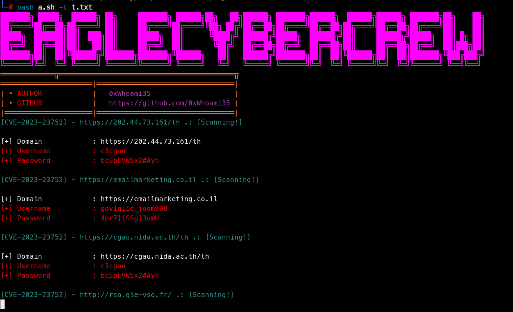

# CVE-2023-23752
 ### About
- This exploit is Authentication Bypass leaking username password administrator and also  leaking mysql config username , password , host and database
- Vulnerable Version only (4.00 => 4.28)<br>

 ## Usage

```
usage: exploit.sh [-h] [-u URL] [-t TARGETS]

CVE-2023-23752 - Authentication Bypass Information Leak on Joomla!

options:
  -h, --help            show this help message and exit
  -u URL, --url URL     Single URL to scan
  -t TARGETS, --targets TARGETS
                        File containing multiple URLs to scan
````

## Proof Of Concept (POC)



- Single target
`bash exploit.sh -u https://example.com`

- Multiple Target
`bash exploit.sh -t targets.txt`

#### Refference:
- [EDB](https://www.exploit-db.com/exploits/51334)
- [VulnCheck](https://vulncheck.com/blog/joomla-for-rce)


## Donation

https://www.buymeacoffee.com/ardian0917s


## Blog
https://0xwhoami35.github.io/

## Disclaimer
We don't promote or encourage any illegal activity, all content provided by this repository is meant for research, educational, and threat detection purpose only.


